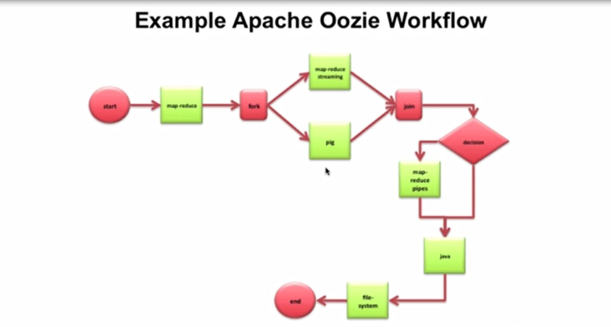

# learning-oozie

* Defining workflow and scheduling.
* Oozie is a server based Workflow Engine.
* Oozie workflows definitions are written in hPDL
  * Oozie workflows contain control flow nodes and action nodes.
  * Control flow nodes define the beginning and the end of a workflow ( start , end and fail nodes) and provide a mechanism to control the workflow execution path ( decision , fork and join nodes)
  * Action nodes are the mechanism by which a workflow triggers the execution of a computation/processing task. Oozie provides support for different types of actions: Hadoop map-reduce, Hadoop file system, Pig, SSH, HTTP, eMail and Oozie sub-workflow. Oozie can be extended to support additional type of actions
  * Oozie workflows can be parameterized (using variables like ${inputDir} within the workflow definition). When submitting a workflow job values for the parameters must be provided. If properly parameterized (i.e. using different output directories) several identical workflow jobs can concurrently.

###### Jobs Automation
* workflow scheduler.
* when we run multiple hadoop jobs that use ouput of one job as input of other job.
* make decision on the output of one job.
* Oozie **workflow** jobs are represented as DAG of actions.
* Oozie **Coordinator** jobs are repetitive tasks and are often triggered by time(frequency) and data availability.
* can run map-reduce, pig, hive, sqoop, java programs, shell programs (out of box)
* Provide CLI and a web UI for monitoring.

###### Workflow.xml
* Control flow nodes define beginning and end of a workflow(start, end, fail)
* Ozzie can be extended to support additional type of actions.

